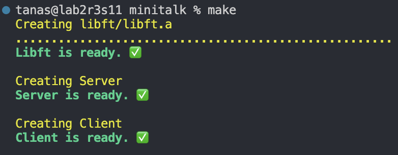
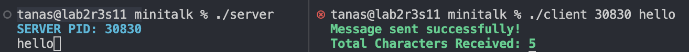
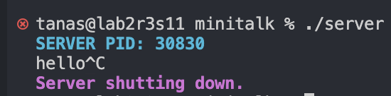
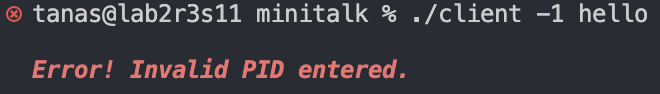

# Minitalk

This project is about sending UNIX-Signals SIGUSR1 and SIGUSR2 between two executable files named Client and Server.
The client will send ASCII/UNICODE characters to the server and the server will print them out immediately. Then the server will send back an acknowledgement SIGUSR1 to the client letting it know that the message was received.

To use this program, first run 'make' then initialize the server by running './server' in one terminal and then in another terminal run './client server-PID string' to make the executables communicate.

'Make':

Using the program:

Shutting down server (Just use CTRL+C):

Example of error handling:

